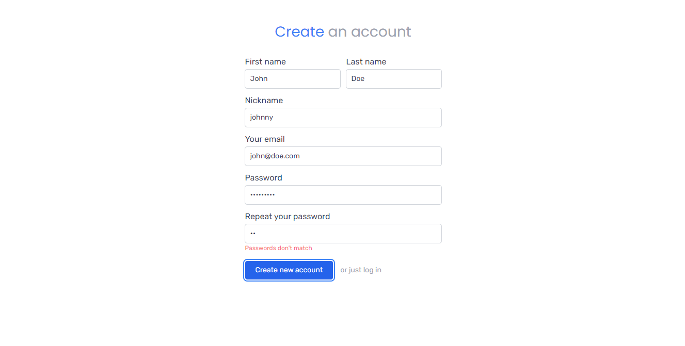
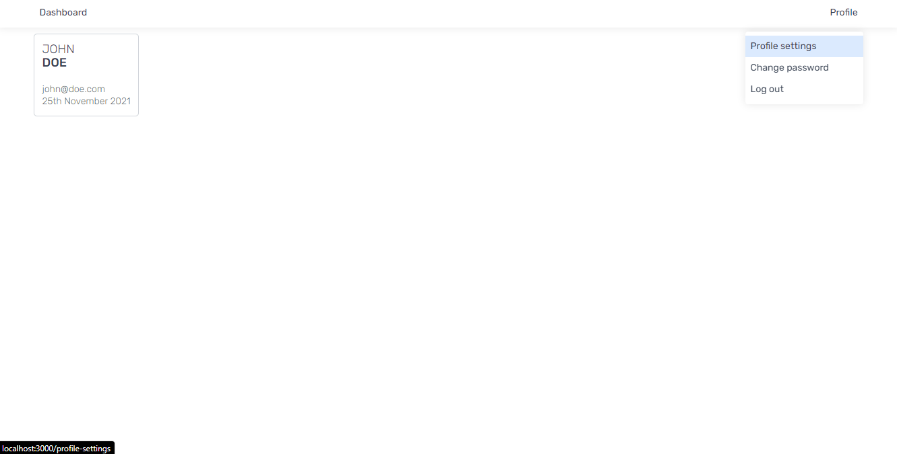
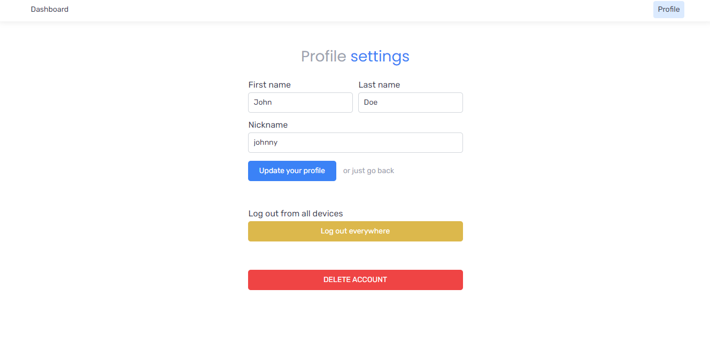

> Full-featured JWT authentication system with user registration, login, profile update, password change and profile delete functionality.

## DISCLAIMER

This app was built as part of a learning process and may NOT meet all security requirements. Therefore, I do not recommend the application to be run in a production environment or collect any sensitive user data.

# ReactJS/Redux/ExpressJS/MongoDB Authentication System

The goal of this project was to create a full-stack JWT authentication system with beautiful UI and proper error handling. The application is built using ReactJS and Redux on the frontend and NodeJS/ExpressJS and MongoDB/Mongoose on the backend. 

---

### Setup
1. Install required dependencies in the root redux-auth/ folder, server and client folder using `yarn install`
2. Run a MongoDB database docker container using `docker run --name mongodb -p 27017:27017 -d mongo`
3. In the redux-auth/server directory rename the `.env.sample` file to `.env` and fill in the required environment variables
4. In the root redux-auth/ directory run `yarn dev` to run the development server for both frontend and backend

Open http://localhost:3000 with your browser to see the result. Create and account and test all the features that are available. :)

---

